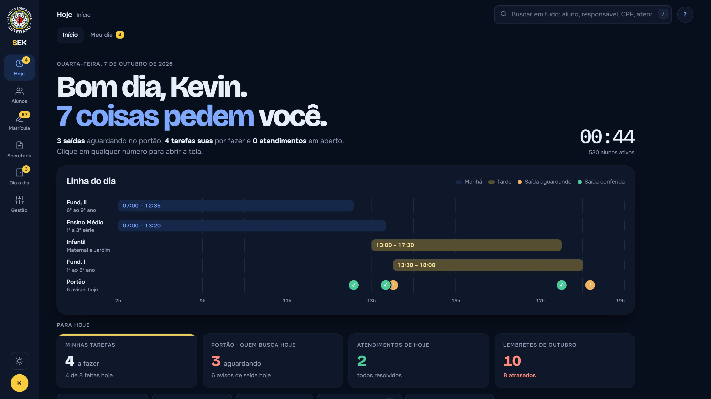
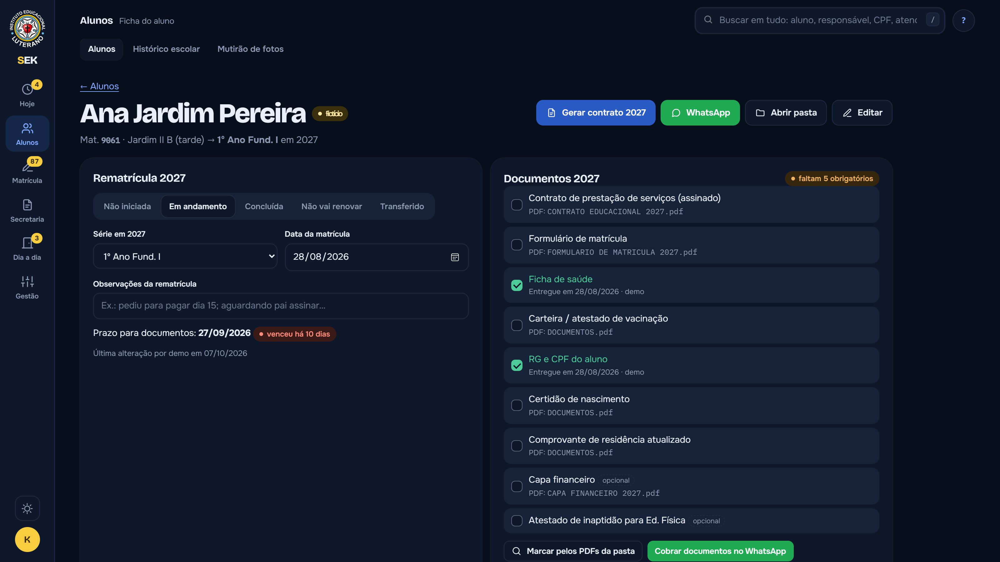
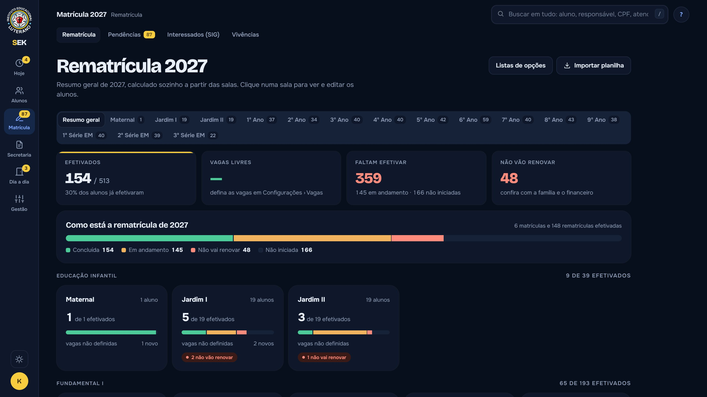
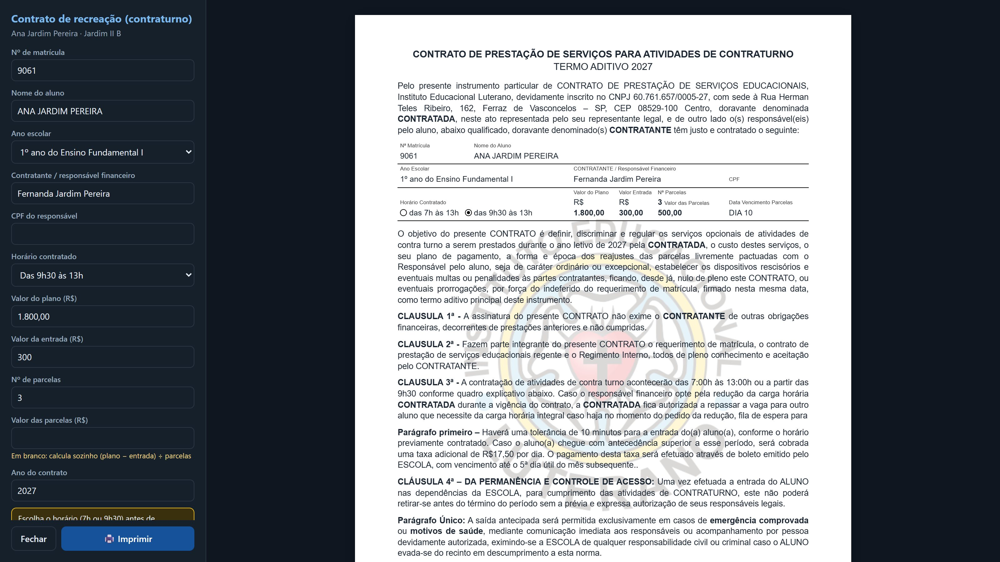
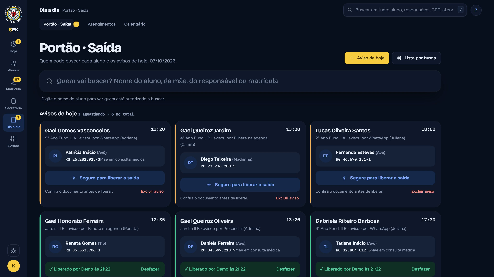
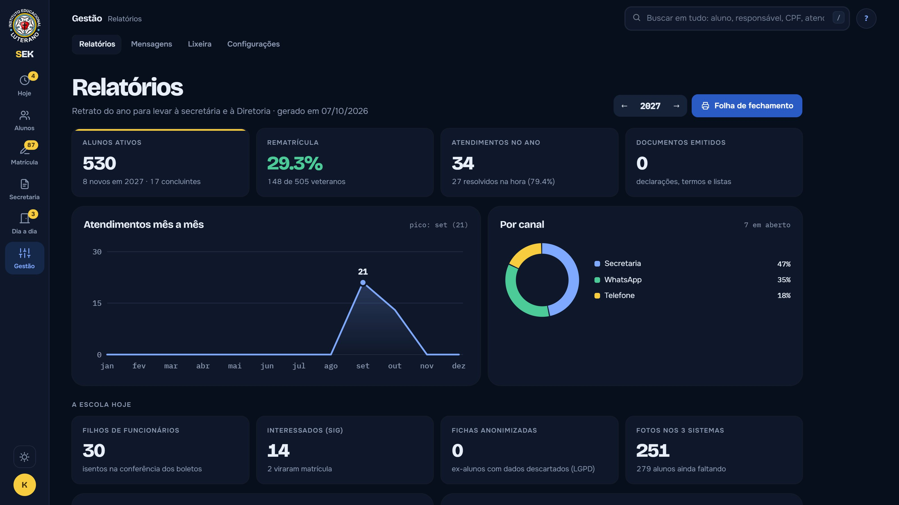
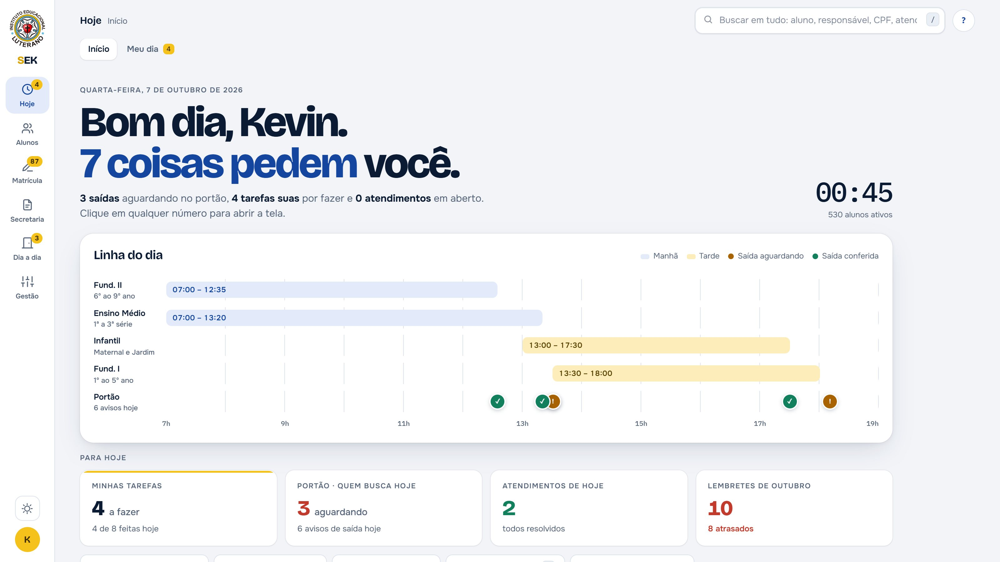

# SEK · Sistema da Secretaria Escolar

**A secretaria escolar inteira. Em um só lugar.**

O SEK é um sistema web que criei do zero, como jovem aprendiz, para a secretaria da escola onde trabalho. Ele junta num só lugar o que antes ficava espalhado em papel, planilhas e anotações, e **hoje já está em produção na instituição**.

▶️ **[Veja a página do projeto, com o vídeo de demonstração](https://kevinhsdev.github.io/sek-publico/)**

---

## O que ele faz

| | |
|---|---|
| **Início** | Saídas no portão, tarefas, atendimentos e lembretes do dia, tudo contado e clicável |
| **Busca global** | Aluno, responsável, CPF ou atendimento em segundos (tecla `/`) |
| **Ficha do aluno** | Rematrícula, documentos, contatos, quem pode buscar, fotos e histórico |
| **Rematrícula** | Resumo geral calculado sozinho, sala por sala, no lugar da planilha |
| **Documentos** | Declarações, termos, contratos e histórico escolar preenchidos automaticamente |
| **Portão** | Quem pode buscar cada aluno, com "segure para liberar" e registro de quem conferiu |
| **Calendário e relatórios** | Lembretes do ano e o retrato da secretaria em uma tela |
| **Do seu jeito** | Tema claro e escuro, atalhos de teclado, ajuda em cada tela |

## Telas

| | |
|---|---|
|  |  |
|  |  |
|  |  |

## Tecnologia

- **Node.js**: servidor próprio, sem frameworks, rodando num computador da secretaria e acessado pelos outros pelo navegador
- **SQLite**: banco em um arquivo só, com backup cifrado e restauração
- **JavaScript, HTML e CSS**: interface feita à mão, com tema claro e escuro
- **Segurança e LGPD**: senhas protegidas, bloqueio de tela, lixeira de 30 dias, registro de quem fez o quê e aviso quando duas pessoas editam a mesma ficha

## Sobre este repositório

Este repositório é uma **vitrine** do projeto: tem a página de apresentação, o vídeo e as imagens.
O código do sistema não é público porque ele está em uso na escola e trata dados de alunos menores de idade.

Todos os alunos, famílias e números que aparecem nas imagens e no vídeo são **fictícios** (dados de demonstração).

## O que mais aprendi

Ouvir quem usa no dia a dia. Cada tela nasceu de um problema real da secretaria.

*Menos papel. Menos planilha. Mais tempo para as pessoas.*
